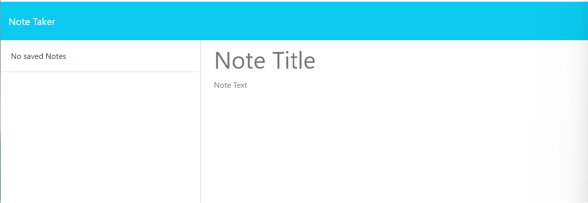
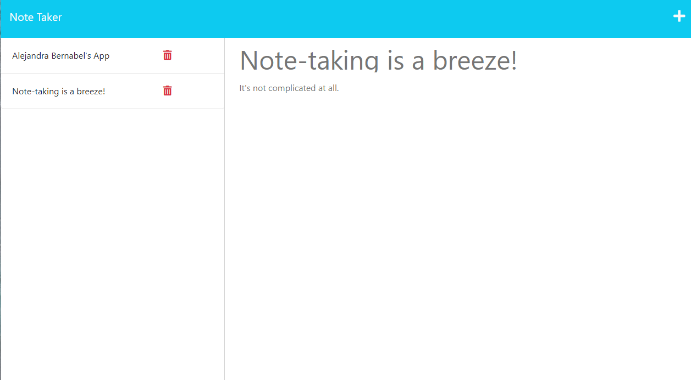

# Note-Taker
[(https://img.shields.io/badge/License-MIT-yellow.svg)](https://opensource.org/licenses/MIT)

## Description

An application that can be used to write and save notes. This application uses an Express.js back end and will save and retrieve note data from a JSON file.

## Github Repository

https://github.com/alejandra-e-bernabel/Note-Taker

## Heroku Deployed File

https://alejandra-note-taker-52375894909d.herokuapp.com/notes

## Table of Contents

- [Installation](#installation)
- [Usage](#usage)
- [License](#license)
- [Questions](#questions?)

## Installation and Dependencies

Dependencies: express, uuid (install dependencies using commands npm i express and npm i uuid).

Launch application using npm start in command line. In your broser, go to https://alejandra-note-taker-52375894909d.herokuapp.com/notes to view deployed application.

## Usage

After launching application, enter notes by typing a title and a body of text for the note. A button will appear in the upper right hand corner. All created notes can be viewed by clicking on the note as listed on the right of the application. Notes cannot be edited once created, but they can be deleted if needed.

## License 

[MIT](https://choosealicense.com/licenses/mit/)

## Questions? 

If you have questions or have notived a bug in this code, please reach out to Alejandra Bernabel

Email: alejandra-e-bernabel@gmail.com
GitHub: alejandra-e-bernabel
